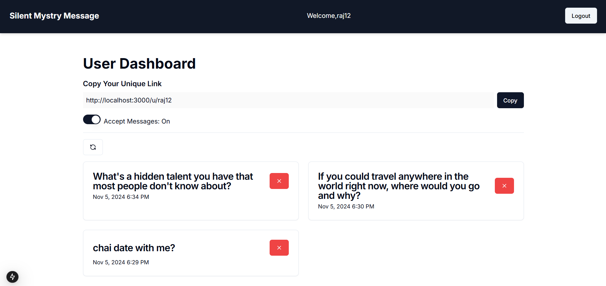

---

## SilentFeedback Project Documentation

### Overview
SilentFeedback is a feedback platform enabling users to give and receive anonymous messages in a secure and streamlined environment. This app is built with Next.js and the MERN stack (MongoDB, Express, React, and Node.js), ensuring a powerful, scalable experience.

---

## 📸 Screenshots

### Home Page


### Verified User Dashboard


### Anonymous Person Sending Message To Verified User


---

### Key Features:
- **Anonymity First**: Allow users to share genuine feedback without revealing identities.
- **Seamless Experience**: Optimized with Next.js and Tailwind CSS for speed and elegance.
- **Real-Time Messaging**: Efficiently powered by the MERN stack and secure backend.

### Directory Structure

```plaintext
src
├───app
│   ├───(app) - Main application files
│   ├───(auth) - Authentication-related routes
│   │   ├───sign-in - User sign-in page
│   │   ├───sign-up - User sign-up page
│   │   └───verify/[username] - Account verification
│   ├───api - Backend API routes
│   │   ├───auth/[...nextauth] - Authentication handling via NextAuth
│   │   ├───accept-messages - Accept feedback messages
│   │   ├───delete-message/[messageid] - Delete specific messages
│   │   ├───get-messages - Retrieve user messages
│   │   ├───send-message - Route for sending messages
│   │   ├───check-username-unique - Check if username is unique
│   │   ├───sign-up - Registration API route
│   │   ├───suggest-messages - Suggestions for messages
│   │   └───verify-code - Email/code verification
│   ├───fonts - Custom fonts for the UI
│   └───u/[username] - User profiles
├───components
│   └───ui - UI components like buttons, forms, etc.
├───context - Context providers, e.g., AuthProvider for user authentication
├───helpers - Helper functions for common operations
├───hooks - Custom React hooks for reusable logic
├───lib - Libraries for database connections or API clients
├───model - Database models for MongoDB collections
├───schemas - Validation schemas for data consistency
└───types - Type definitions for TypeScript

```

### Key Functional Modules

- **Authentication** (`app/(auth)`): Handles user login, signup, and account verification.
- **API** (`app/api`): Defines all backend routes for processing feedback, managing accounts, and interacting with the MongoDB database.
- **User Profiles** (`app/u/[username]`): Each user has a profile page where they can view their feedback.
- **Reusable Components** (`components/ui`): Pre-built UI elements for consistent design.
- **Context** (`context`): Context providers, especially for authentication, allowing global access to user data.
- **Database Models** (`model`): MongoDB models for schema-based interaction with the database, ensuring data integrity.

### Getting Started

1. **Installation**: Clone the repo, then run `npm install` to install dependencies.
2. **Environment Setup**: Create a `.env` file with necessary environment variables (database URL, NextAuth secrets, etc.).
3. **Running Locally**: Use `npm run dev` to start the development server at `http://localhost:3000`.
4. **Build and Deploy**: Run `npm run build` for production builds. Deploy using platforms like Vercel for serverless deployment.

---


## For next-auth setup
    
* should have knowledge of provider and callbacks.
* set up next auth.

## Lucide-react
* there are many icons (available here)

## ui.shadcn
* components used from shadcn
* [docs](https://ui.shadcn.com/docs/components)

## usehooks-ts
* useDebounceValue
* [docs](https://usehooks-ts.com/react-hook/use-debounce-value)
    
## react-hook-form
* form n zod
* [docs](https://www.react-hook-form.com/get-started)
* [watch/setValue/useForm](https://react-hook-form.com/docs/useform/watch) -> for toggle input 
* usecallbackhook -> use


